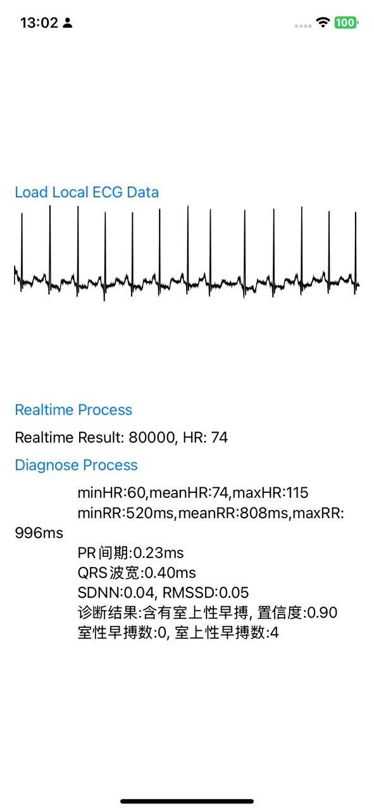

# 说明

版本说明:

- 0.1.0
  - 添加 AI 算法
  - 添加内建缓冲区的实时算法 `continueProcess`
  - 添加试用 keyAPI, 有效期至 2024年 12 月 31 日
    - 使用SDK 前请先调用`register`方法

- 0.0.1
  - 半成品, 提供主要的 SDK 框架以便提前做集成工作
  - 无鉴权, 3 个月后自动失效





# 使用说明

## 0x01 引入Framework

支持 CocoaPod 引入和直接引入.
### CocoaPod 引入

```podfile
  use_frameworks!
  # Improt from local
  pod 'ECGSDK', :path => './ECGSDK'
  # or
  # Import from github
  # pod 'ECGSDK', :path => 'https://github.com/GrayLand119/ecgi_ring_sdk_ios.git'
```

### 直接引入

Project -> TARGETS -> Build Phases -> Link Binary With Libraries -> `选择 ECGSDK.xcframework` 即可

## 0x02 使用 SDK

添加引用:

```swift
import ECGSDK	
```

必须通过`shared`方法使用单例来调用接口:

```swift
// 必须使用单例, sdk = SMEcgSdk() 创建的实例,调用诊断接口将返回错误
let sdk = SMEcgSdk.shared()

// Load datas from csv file.
let path=Bundle.main.path(forResource: "normal100", ofType: "csv")!
let ecgData: Array = sdk.readCSV(path)
// Realtime process
let result = sdk.realtimeProcess(ecgData, fs: 250.0)
// Filtered datas
let filtered = result[0] as! Array<Any>
// Mean Heart Rate
let hr = result[1] as? Double ?? 0.0
```


使用方法具体见 Demo.

### 接口说明

```objc
/// 实时算法
/// 实时采集心电时可以调用此算法
/// - Parameters:
///   - rawData: 原始心电数据
///   - fs: 采样率
/// - Returns:
///     - array[0]: 处理后的心电数据
///     - array[1]: 平均心率
- (NSArray *)realtimeProcess:(NSArray<NSNumber *> *)rawData fs:(double)fs;

/// 诊断算法
/// 传入 30~300 秒的心电数据, 计算后返回诊断结果
/// - Parameters:
///   - rawData: 原始心电数据
///   - fs: 采样率
/// - Returns:
///   - resultArray 一组数据, 其中:
///   - resultArray[0]: 处理后的心电数据
///   - resultArray[1]: 心率相关信息 see [README#心率相关信息]
///   - resultArray[2]: 心律(节律)相关信息 see [README#节律相关信息]
- (NSArray<NSArray<NSNumber *> *>*)diagnose:(NSArray<NSNumber *> *)rawData fs:(double)fs;

```


# 心率相关信息

0. minHR
1. meanHR
2. maxHR
3. minRR(ms)
4. meanRR(ms)
5. maxRR(ms)
6. PR间期(ms)
7. QRS 波宽(ms)
8. SDNN
9. RMSSD
10. 漏搏数量
11. 室性早搏数量
12. 室上性早搏数量


# 节律相关信息

0. TypeIndex, 诊断结果(0~5)
   0. 正常
   1. 房扑
   2. 房颤
   3. 室颤/室扑
   4. 其他心律不齐
   5. 噪声
   6. 含有室上性早搏
   7. 含有室性早搏
1. 置信度(0.0~1.0)